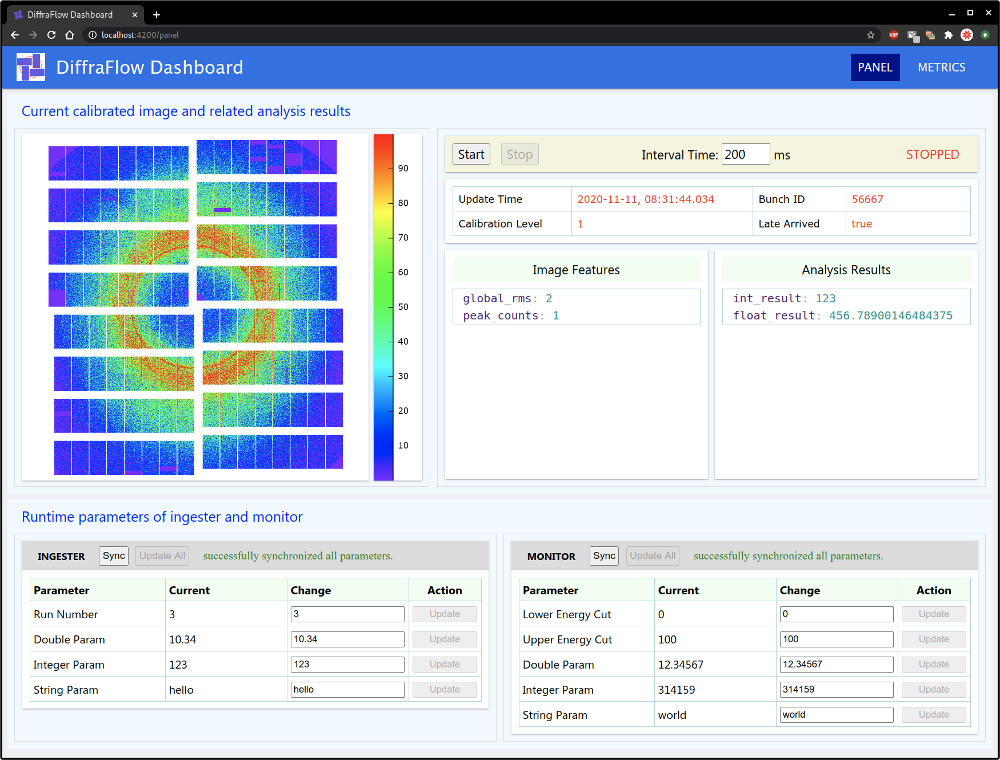

# DiffraFlow Dashboard

 This dashbord serves as a GUI of the DiffraFlow project, which can dynamically display the current working
 status of the whole system (in METRICS page), dynamically monitor the current image and related analysis results
 and configure the runtime parameters of **ingester** and **monitor** (in PANEL page). A screenshot of the PANEL
 page is shown below.

 

 Note: the image shown in this screenshot is from the test data generated using [CXIDB ID 83](https://cxidb.org/id-83.html).
